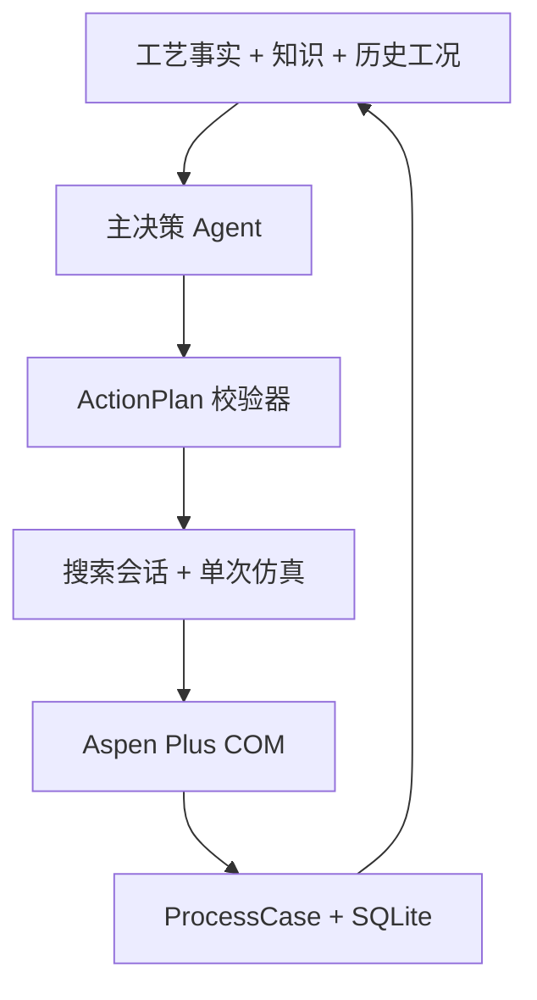

# PAO — Process Aspen Optimization

PAO 是一个以 Aspen Plus 为仿真执行层的化工流程优化工具。项目通过 Windows COM 驱动 Aspen Plus，把 YAML 配置、单目标/多目标贝叶斯优化、Pareto 分析、工艺知识和 Agent 决策串成一套可追溯的实验闭环。

当前仓库的主线是 **CLI + Aspen 驱动 + 优化器 + 一个主决策 Agent**。Agent 不直接操作 COM，而是读取工艺事实和历史工况，提出受约束的结构化动作；PAO 校验动作后调用现有仿真接口，再把结果反馈给下一轮决策。

## 当前实现范围

| 入口 | 输入 | 当前行为 |
|---|---|---|
| 普通 YAML | `optimizer.type: bayesian` | 单目标贝叶斯优化 |
| 普通 YAML | `optimizer.type: pareto_bayesian` | 多目标 Pareto 贝叶斯优化 |
| Agent YAML | YAML + `--agent`，或 YAML 中 `agent_loop.enabled: true` | 进入持久化自主实验闭环；当前要求 Pareto 配置 |
| 裸 Aspen 文件 | `.bkp/.apw` + `--agent` | Coordinator 根据 `--intent` 路由到接入、边界、动力学或过程分析任务 |
| LangGraph | `PAOGraphState.agent_loop.enabled=True` | 保留首次人工确认，确认后进入自主闭环 |

裸 Aspen 文件的 Coordinator 是任务接入和路由入口；真正的“仿真结果 → 下一次参数决策”闭环使用 YAML Agent 入口。当前不需要多 Agent 才能完成闭环：一个主决策 Agent 负责假设和动作，现有优化器负责候选生成，Aspen 负责过程评价，数据库负责证据留存。

## Agent 闭环



每轮闭环包含以下步骤：

1. 读取近期收敛状态、目标、约束、失败诊断、Pareto 证据和剩余预算。
2. Agent 输出 `ActionPlan`，动作只能是 `continue`、`set_region`、`probe` 或 `stop`。
3. 程序校验证据 ID、变量类型、整数约束、变量依赖、硬边界、搜索区域和批次预算。
4. `ParetoSearchSession` 在软搜索区内生成候选；随后执行整数修复、derived 变量映射、预检查和实际 Aspen 输入去重。
5. `run_case()` 调用 Aspen，结果以 `ProcessCase` 保存，并通过 `tell()` 更新代理模型。
6. 达到目标、预算耗尽、连续失败、停滞或 Agent 请求停止时，对一个代表可行工况进行独立复验。

每次决策快照还会自动生成结构化 `analysis_report`。它由确定性的程序代码计算，包含
数据质量、收敛率、目标/约束趋势、Pareto/HV、敏感性排序和失败模式；主 Agent 只负责
根据这些证据选择下一步动作。动作前后的报告分别写入 checkpoint 的
`before_analysis`、`after_analysis`，并保存 `analysis_effect` 指标差异（仅表示观察到的
相关性，不自动宣称因果）。敏感性排序同时保存有效样本数和 `reliable` 标记，样本不足时
不会被提示词当作可信物理规律。

Agent 可以改变软搜索区，但不能修改以下内容：

- `design_variables` 的工程硬边界；
- 产品纯度、流量、温度等约束；
- 目标函数、物性模型和反应动力学参数；
- 任意 Aspen 写入路径或可执行代码。

没有配置 LLM key 时，`ProcessDecisionAgent` 会明确降级为规则决策，闭环、预算、约束和断点机制仍然运行。

详细设计见 [docs/agent_closed_loop.md](docs/agent_closed_loop.md)。

### 离线分析工具

不启动 Aspen 也可以让 Agent 或人工审查历史工况。`analyze_closed_loop_tool` 从
`SimulationDB` 读取记录并返回与闭环相同的 JSON 分析报告，支持按 `session_id`、迭代范围
和 tags 过滤：

```python
from src.agents.tools import analyze_closed_loop_tool

report_json = analyze_closed_loop_tool.invoke({
    "db_path": "cases/demo_case_2/output/simulation.db",
    "objective_names": "CAPEX,EMISSIONS",
    "session_id": "optional-session-id",
})
```

默认 Pareto 只使用可行工况；只有在研究可行域或约束松弛时才设置
`include_infeasible=True`。该工具是确定性数据分析 skill，不会创建额外的自主 Agent。

## 环境要求

- Python 3.10+（CI 使用 Python 3.12，建议使用 3.12）。
- 真实 Aspen 运行：Windows、已安装并激活许可证的 Aspen Plus，以及可用的 `.bkp`/`.apw` 模型。
- Linux/macOS：可以运行不连接 Aspen 的合成测试和配置检查，但不能使用 Windows COM 驱动真实 Aspen。
- 完整依赖见 [requirements.txt](requirements.txt)；其中 `torch`/`botorch`/`gpytorch` 用于可选 qEHVI/qNEHVI 后端，缺失时会退回兼容的 GP/随机搜索路径。

## 快速开始

### 1. 真实 Aspen 运行

真实仿真需要 Windows、Aspen Plus 和可用许可证。建议从项目根目录执行：

```powershell
git clone https://github.com/RuoQ3/PAO.git
cd PAO

python -m venv .venv
.venv\Scripts\Activate.ps1
python -m pip install -r requirements.txt
```

### 2. 先做配置检查

`--dry-run` 不连接 Aspen、不调用 LLM，也不修改 YAML：

```bash
python -m src.main cases/demo_case_2/agent_loop_config.yaml --dry-run
```

### 3. 启动 Agent 闭环

示例配置已经包含 `agent_loop.enabled: true`、硬边界、软搜索区、工艺事实和默认知识库：

```bash
# 启动新会话；总预算 40 次，包含最终复验
python -m src.main cases/demo_case_2/agent_loop_config.yaml --agent

# 使用命令行指定 checkpoint 路径
python -m src.main cases/demo_case_2/agent_loop_config.yaml \
  --agent --checkpoint cases/demo_case_2/output/agent_run.db

# 从同一个 checkpoint 恢复
python -m src.main cases/demo_case_2/agent_loop_config.yaml --agent --resume
```

配置中的相对 `checkpoint_path` 相对于 YAML 文件所在目录解析。checkpoint 已存在时必须显式使用 `--resume`；不要把 checkpoint 和 `SimulationDB` 指向同一个 SQLite 文件。

闭环结束后会生成：

- `*.db`：Agent checkpoint，保存动作、证据、预算、随机状态和 pending 状态；
- `*.report.json`：机器可读审计记录；
- `*.report.md`：人类可读的决策和结果报告；
- `simulation.db`：现有报告/查询层使用的工况数据库投影。

### 4. 运行普通优化器

不启用 `agent_loop` 时，仍可直接运行现有优化器：

```bash
# 多目标 Pareto 优化
python -m src.main cases/demo_case/pareto_config.yaml

# 指定结果数据库和日志级别
python -m src.main cases/demo_case/pareto_config.yaml \
  --db cases/demo_case/output/run.db --log DEBUG

# 只检查配置
python -m src.main cases/demo_case/pareto_config.yaml --dry-run
```

### 5. 接入裸 Aspen 文件

裸 `.bkp`/`.apw` 文件不能直接进入 YAML 优化循环，需要先使用 Coordinator 描述任务：

```bash
python -m src.main cases/demo_case/二级氢氰化工段.bkp --agent \
  --intent "帮我接入这个工艺并分析可调变量"

# 连续对话模式；会记住上一轮生成的配置或数据库路径，但不记忆拟合数值
python -m src.main cases/demo_case/二级氢氰化工段.bkp --agent --chat
```

动力学拟合任务可附带实验数据：

```bash
python -m src.main cases/demo_case/二级氢氰化工段.bkp --agent \
  --intent "帮我拟合这批实验数据的活化能" \
  --data path/to/kinetics.csv
```

## LLM 配置

LLM key 不写入 YAML、代码或 checkpoint，只从环境变量读取。可复制 `.env.example`：

```powershell
Copy-Item .env.example .env
```

支持的环境变量：

| 变量 | 作用 |
|---|---|
| `PAO_LLM_PROVIDER` | `anthropic`、`openai` 或 `deepseek` |
| `PAO_LLM_MODEL` | 模型名；留空使用 provider 默认值 |
| `ANTHROPIC_API_KEY` / `OPENAI_API_KEY` / `DEEPSEEK_API_KEY` | 对应 provider 的 key |
| `PAO_LLM_TEMPERATURE` | 采样温度，默认 `0.2` |
| `PAO_LLM_MAX_TOKENS` | 单次输出上限，默认 `2048` |

使用某个 provider 时，还需要安装对应的 LangChain provider adapter。没有 key 或 adapter 时，Agent 会回退到规则决策或返回明确错误，不会伪装成 LLM 已经执行。

## YAML 配置要点

当前解析器使用 `n_initial_points`、`n_iterations` 和 `acquisition_function` 等字段；旧 README 中的 `n_initial`、`acquisition` 写法不应直接复制。

```yaml
simulator:
  filepath: cases/demo_case_2/2epsd.bkp
  reinit: true                 # Agent 闭环必须为 true
  verify_inputs: true
  timeout: 300

design_variables:
  - name: T1_RR
    aspen_path: \\Data\\Blocks\\T1\\Input\\BASIS_RR
    type: continuous           # continuous | integer | derived
    lower_bound: 0.416
    upper_bound: 2.08
    initial_value: 0.832

objectives:
  - name: CAPEX
    type: custom_module         # aspen_path | tac | emissions | custom_module
    module: cases/demo_case_2/epsd_objectives.py
    function: make_epsd_capex_objective
    minimize: true

constraints:
  - name: product_purity
    aspen_path: \\Data\\Streams\\D1\\Output\\MOLEFRAC\\MIXED\\PF
    operator: ">="
    threshold: 0.999

optimizer:
  type: pareto_bayesian
  n_initial_points: 20
  n_iterations: 60
  surrogate_model: qEHVI    # GP | RF | ET | GBRT | random | qEHVI | NEHVI
  acquisition_function: EI  # EI | UCB | PI
  scalarization: chebyshev  # weighted_sum | chebyshev
  random_seed: 42

search_region:
  T1_RR: [0.7, 1.0]          # 软搜索区，可用变量 name 或 Aspen path

agent_loop:
  enabled: true
  max_evaluations: 40
  batch_size: 5
  failure_trigger: 3
  max_decisions: 12
  max_step_fraction: 0.1
  verification_repeats: 1
  verification_rtol: 0.02
  objective_targets: {}
  checkpoint_path: output/agent_checkpoint.db
  process_facts:
    description: "体系、物性方法、设备限制和已知可行工况"
```

几个容易混淆的字段：

| 配置 | 含义 |
|---|---|
| `lower_bound` / `upper_bound` | Agent 不可突破的工程硬边界 |
| `search_region` | Agent 可调整的软搜索区，始终必须在硬边界内 |
| `agent_loop.max_evaluations` | Agent 闭环总预算，失败、预检查拦截和复验都占用预算 |
| `agent_loop.objective_targets` | 可选的原始目标阈值；空字典不表示自动达标 |
| `type: derived` | 优化虚拟变量，运行前按依赖变量映射为真实 Aspen 输入 |
| `type: custom_module` | 从指定 Python 模块加载目标函数；模块内容会参与 checkpoint 指纹 |

改变硬边界、产品约束、物性/动力学模型或目标函数，代表一个新的优化问题，应使用新的 checkpoint。

## 持久化、约束和复验

- checkpoint 是闭环恢复的权威记录，`SimulationDB` 是查询和报告投影。
- 每次调用 Aspen 前都会先保存 `pending` 并扣除预算；进程在仿真中途退出时，该次结果按“未知失败”计入预算，不自动重复运行。
- 恢复时会重建代理模型，不恢复 COM 对象；首次运行、恢复会话、上一轮失败或驱动重建后会强制使用 `reset` 初始化。
- 收敛但违反产品约束的工况仍可进入 BoTorch 约束/目标学习；Pareto 前沿只接受可行工况。
- `target_verified` 只表示同一个代表工况达到目标并通过复验，不表示整个 Pareto 前沿或全局最优已经被证明。

闭环结果状态：

| 状态 | 含义 |
|---|---|
| `target_verified` | 代表工况达到目标并通过独立复验 |
| `completed_verified` | 代表工况复验通过，但没有指定目标声明 |
| `verification_failed` | 复验未收敛、约束失败或目标偏差超出容差 |
| `no_feasible_solution` | 当前预算内没有找到可行解 |
| `unverified` | 例如 Aspen 驱动不可用，未完成复验 |

## 代码结构

```text
PAO/
├── src/
│   ├── main.py                       # CLI 入口
│   ├── aspen_driver/                 # Aspen Plus COM、节点、运行和导出
│   ├── workflows/
│   │   ├── run_case.py               # 单次仿真与目标/约束计算
│   │   ├── optimize_case.py          # 单目标优化
│   │   ├── optimize_pareto_case.py   # 多目标优化与闭环路由
│   │   ├── agent_entry.py            # Agent 配置和结果适配
│   │   └── agent_optimize.py         # observe/decide/ask/evaluate/tell
│   ├── optimization/
│   │   ├── search_session.py         # 增量 ask/tell 搜索会话
│   │   ├── surrogate.py              # skopt 与随机回退
│   │   ├── botorch_backend.py        # 可选 qEHVI/qNEHVI 后端
│   │   └── pareto.py                 # Pareto 与超体积计算
│   ├── agents/
│   │   ├── closed_loop/              # ActionPlan、主 Agent、分析报告、checkpoint
│   │   ├── tools/                    # LangChain 工具（含离线闭环分析）
│   │   ├── coordinator/              # 裸 Aspen 文件的任务路由
│   │   ├── onboarding_agent/         # 变量发现和配置草案
│   │   ├── boundary_advisor/         # 边界建议
│   │   ├── process_advisor/          # 结果分析
│   │   ├── kinetics_advisor/         # 动力学拟合/建议
│   │   ├── graph.py                  # LangGraph + HITL 状态机
│   │   └── hitl_protocol.py          # HITL 会话协议
│   ├── database/                     # SimulationDB 与 node DB
│   ├── models/                       # ProcessCase、SimulationResult 等
│   └── economics/                    # TAC 与排放目标
├── cases/                            # Aspen 模型和 YAML 示例
├── configs/aspen_semantics/          # Aspen 语义规则
├── configs/process_knowledge/        # Agent 可审查工艺知识
├── docs/                             # 设计和使用文档
└── tests/                            # Linux 可执行的合成/集成测试
```

当前仓库没有跟踪 `backend/` 或 `frontend/` 源码，因此本 README 不提供 Web 服务启动命令；`requirements.txt` 中保留的 FastAPI 相关依赖不能代表 Web 控制面板已经包含在本仓库中。

## 测试与 CI

不连接 Aspen 的 Linux 测试可以安装最小依赖后执行：

```bash
python -m pip install pytest PyYAML numpy scikit-optimize python-dotenv langgraph langchain-core
python -m pytest -q
python -m compileall -q src tests
```

当前闭环改造的测试结果为 `35 passed, 1 skipped`。跳过项是可选 BoTorch 联合 GP 测试；安装兼容的 `torch`、`botorch` 和 `gpytorch` 后才会运行。GitHub Actions 配置位于 `.github/workflows/agent-loop.yml`。

真实 Aspen 验收仍需在 Windows + Aspen Plus 环境中进行，建议使用同一 `.bkp` 副本、同一目标/约束和相同总调用预算，对比普通优化器与 Agent 闭环的可行率、首次达标时间、最终目标、失败次数和复验结果。

## 许可证与使用范围

本项目当前为研究与工程验证代码。请在实际工艺应用前核对 Aspen 模型、物性方法、设备边界、产品约束和结果复验，不要把 Agent 的规则判断当作经过认证的化工专家系统结论。
